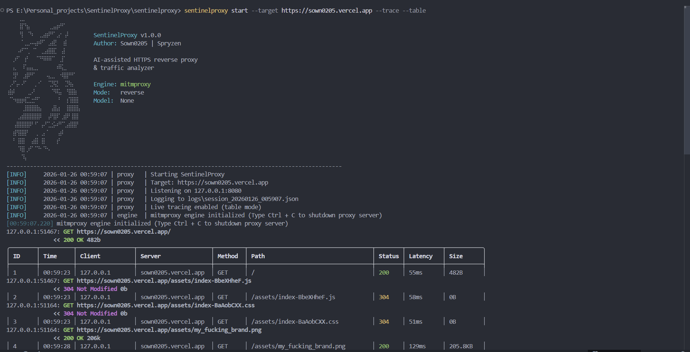
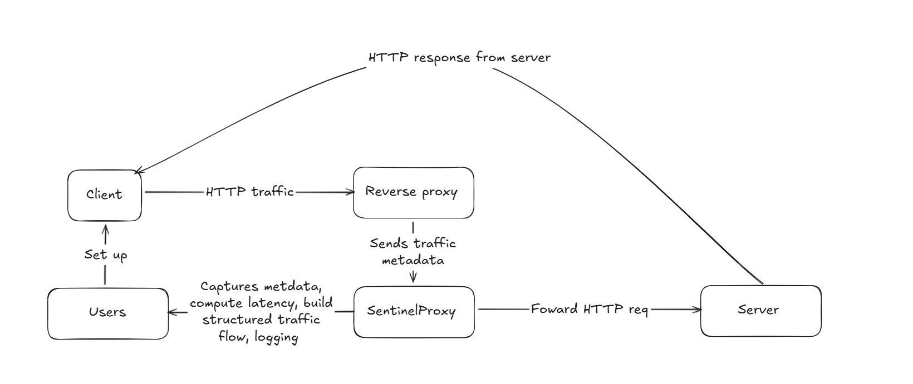
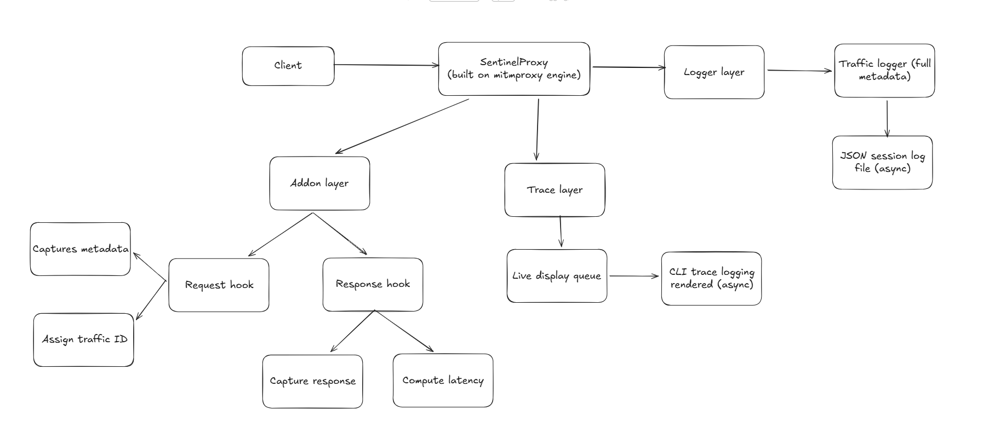

# SentinelProxy

**AI-assisted HTTPS reverse proxy & traffic analyzer**

SentinelProxy is a reverse HTTPS proxy designed to intercept, log, and analyze traffic between clients and upstream servers. Built on top of mitmproxy, it provides structured logging, real-time traffic tracing, and an AI-ready architecture for future traffic analysis capabilities.


---

## Table of Contents

- [Features](#features)
- [Requirements](#requirements)
- [Installation](#installation)
- [Quick Start](#quick-start)
- [CLI Reference](#cli-reference)
- [Configuration Options](#configuration-options)
- [Traffic Logging](#traffic-logging)
- [Live Trace Display](#live-trace-display)
- [Certificate Setup](#certificate-setup)
- [Architecture & Workflow](#architecture--workflow)
- [Examples](#examples)

---

## Features

- **Reverse Proxy**: Intercept HTTPS traffic to any target server
- **Structured Logging**: All traffic logged in JSONL format for easy parsing
- **Real-Time Tracing**: Live terminal display of requests with color-coded status
- **Smart Filtering**: Filter traces by host, path, latency, or error status
- **Security First**: Sensitive headers (auth, cookies) automatically filtered from logs
- **AI-Ready**: Structured logs with request IDs and metadata prepared for AI analysis
- **Professional CLI**: Clean, quiet by default, with detailed output when needed

---

## Requirements

- Python 3.10 or higher
- Windows, macOS, or Linux

---

## Installation

### From Source

```bash
# Clone the repository
git clone https://github.com/Sown0205/SentinelProxy.git
cd SentinelProxy

# Install in development mode
pip install -e .

# Verify installation
sentinelproxy --version
```

### Dependencies

SentinelProxy will automatically install:
- `mitmproxy` - Core proxy engine
- `click` - CLI framework
- `colorama` - Cross-platform colored terminal output

---

## Quick Start

### 1. Start the Proxy

```bash
# Basic usage - proxy traffic to example.com
sentinelproxy start --target https://api.example.com

# With live tracing enabled
sentinelproxy start --target https://api.example.com --trace
```

### 2. Configure Your Client

Point your HTTP client to the proxy:
- **Proxy Address**: `127.0.0.1:8080` (default)
- **Target**: Requests are forwarded to the specified target

### 3. Install CA Certificate (for HTTPS)

```bash
# Check certificate status
sentinelproxy cert status

# Get installation instructions
sentinelproxy cert install
```

### 4. View Logs

Session logs are saved to `logs/session_YYYYMMDD_HHMMSS.jsonl`

---

## CLI Reference

### Main Commands

```bash
sentinelproxy [OPTIONS] COMMAND [ARGS]
```

| Command | Description |
|---------|-------------|
| `start` | Start the reverse proxy |
| `cert`  | Certificate management commands |
| `--version` | Show version and exit |
| `--help` | Show help message |

### Start Command

```bash
sentinelproxy start [OPTIONS]
```

| Option | Description | Default |
|--------|-------------|---------|
| `--listen ADDRESS` | Local bind address (host:port) | `127.0.0.1:8080` |
| `--target URL` | Upstream target server URL | *required* |
| `--cert-dir DIR` | Certificate storage directory | `certs/` |
| `--log-dir DIR` | Session log directory | `logs/` |
| `--trace` | Enable live request tracing | off |
| `--verbose` | Enable debug output | off |
| `--stats` | Enable periodic metrics output | off |
| `--only-errors` | Trace only 4xx/5xx responses | off |
| `--table` | Display traces in table format | off |
| `--host HOST` | Filter traces by host | none |
| `--path PATH` | Filter traces by path | none |
| `--min-latency MS` | Show only requests slower than N ms | none |

### Certificate Commands

```bash
sentinelproxy cert status [--cert-dir DIR]   # Show certificate status
sentinelproxy cert install                    # Show installation instructions
```

---

## Configuration Options

### Listen Address

Specify where the proxy listens for connections:

```bash
# Host and port
--listen 127.0.0.1:8080

# Just port (binds to 127.0.0.1)
--listen 8080

# All interfaces
--listen 0.0.0.0:8080
```

### Target URL

The upstream server to forward requests to:

```bash
--target https://api.example.com
--target https://api.example.com:8443
--target http://internal-service.local
```

---

## Traffic Logging

### Log Format

All traffic is logged in JSON format

```json
{
  "request_id": "1024",
  "timestamp": "2026-01-23T18:43:12.341Z",
  "client": {
    "ip": "127.0.0.1",
    "port": 53241
  },
  "server": {
    "host": "api.example.com",
    "port": 443,
    "ip": "93.184.216.34"
  },
  "tls": {
    "version": "TLSv1.3",
    "alpn": "h2",
    "cipher": "TLS_AES_128_GCM_SHA256"
  },
  "request": {
    "method": "POST",
    "path": "/v1/login",
    "http_version": "HTTP/2",
    "headers": {
      "content-type": "application/json"
    },
    "size": 842
  },
  "response": {
    "status": 401,
    "headers": {
      "content-type": "application/json"
    },
    "size": 231
  },
  "latency_ms": 92,
  "flags": ["auth_failed"],
  "ai": {
    "anomaly_score": null,
    "notes": null
  }
}
```

### Log Location

Logs are saved to `logs/session_YYYYMMDD_HHMMSS.json`

### Security Features

The following headers are automatically filtered from logs:
- `Authorization`
- `Cookie` / `Set-Cookie`
- `X-API-Key`
- `X-Auth-Token`
- `X-Access-Token`
- `Proxy-Authorization`

Query parameters are stripped from logged paths.

---

## Live Trace Display

Enable with `--trace` to see real-time request/response information. SentinelProxy supports two display formats: **Log format** (default) and **Table format**.

### Log Format (Default)

The default log format displays each request as a single line:

```
[REQ#1024] 18:43:12  127.0.0.1 -> api.example.com  POST /v1/login   401   92ms
```

With `--verbose`, additional TLS and size information is shown:

```
[REQ#1024] 18:43:12 TLSv1.3  127.0.0.1 -> api.example.com  POST /v1/login   401   92ms   842B
```

### Table Format (with `--table`)

Enable with `--table` to display traces in a structured table with rounded grid borders:

```
╭────────┬──────────┬─────────────────┬──────────────────────┬─────────┬─────────────────────────────────────┬────────┬───────────┬───────────╮
│ ID     │ Time     │ Client          │ Server               │ Method  │ Path                                │ Status │ Latency   │ Size      │
├────────┼──────────┼─────────────────┼──────────────────────┼─────────┼─────────────────────────────────────┼────────┼───────────┼───────────┤
│ 1      │ 18:43:10 │ 127.0.0.1       │ api.example.com      │ GET     │ /v1/users                           │ 200    │ 45ms      │ 1.2KB     │
│ 2      │ 18:43:11 │ 127.0.0.1       │ api.example.com      │ POST    │ /v1/login                           │ 401    │ 92ms      │ 231B      │
│ 3      │ 18:43:12 │ 127.0.0.1       │ api.example.com      │ GET     │ /v1/products                        │ 200    │ 128ms     │ 4.5KB     │
╰────────┴──────────┴─────────────────┴──────────────────────┴─────────┴─────────────────────────────────────┴────────┴───────────┴───────────╯
```

### Color Coding

| Status | Color |
|--------|-------|
| 2xx | Green |
| 3xx | Yellow |
| 4xx | Red |
| 5xx | Red |
| Info | Cyan |

### Filtering Options

Filtering works with both log and table formats:

```bash
# Only show errors
--only-errors

# Only show requests to specific host
--host api.example.com

# Only show requests to specific path
--path /v1/

# Only show slow requests (>100ms)
--min-latency 100
```

---

## Certificate Setup

SentinelProxy uses mitmproxy's certificate authority to intercept HTTPS traffic. On first run, certificates are automatically generated.

### Check Status

```bash
sentinelproxy cert status
```

Output:
```
SentinelProxy Certificate Status
========================================
Certificate Directory: C:\Users\Admin\.mitmproxy
[OK] Root CA certificate found
     Path: C:\Users\Admin\.mitmproxy\mitmproxy-ca-cert.pem
[OK] CA private key found
```

### Install Certificate

```bash
sentinelproxy cert install
```

This displays OS-specific instructions for:
- **Windows**: Import via certmgr or PowerShell
- **macOS**: Import via Keychain Access
- **Linux**: Copy to system trust store
- **Firefox**: Manual import via browser settings

---

## Architecture & Workflow

### System flow


### High-Level Architecture



### Startup Workflow

1. Parse CLI arguments
2. Validate configuration
3. Create log/cert directories
4. Display ASCII banner (if interactive terminal)
5. Initialize traffic logger (starts background thread)
6. Initialize live display (if `--trace` enabled)
7. Launch mitmproxy engine in reverse proxy mode
8. Register SentinelAddon for request/response hooks
9. Print startup status
10. Begin accepting connections

### Request Workflow

For each intercepted request:

1. **Request Hook**:
   - Assign unique request ID
   - Record start timestamp
   - Extract metadata (method, path, headers, client IP)
   - Store context in flow metadata

2. **Response Hook**:
   - Retrieve request context
   - Capture response metadata (status, headers, size)
   - Compute latency
   - Build structured traffic event
   - Queue for JSONL logging (guaranteed write)
   - Queue for live display (may drop if overloaded)

### Shutdown Workflow

1. Receive shutdown signal (Ctrl+C or SIGTERM)
2. Stop accepting new connections
3. Stop live display thread
4. Flush and close traffic logger
5. Print session summary:
   ```
   [INFO] Session summary:
          Requests: 248
          Errors:   2
          Duration: 00:03:41
   [INFO] Goodbye.
   ```

### Threading Model

| Thread | Purpose | Behavior |
|--------|---------|----------|
| Main | Proxy engine (mitmproxy) | Handles all traffic |
| Logger | Writes JSONL events | Never drops, flushes on each write |
| Display | Prints trace lines | Drops events if queue full (non-blocking) |

---

## Examples

### Basic Reverse Proxy

```bash
sentinelproxy start --target https://jsonplaceholder.typicode.com
```

Then make requests:
```bash
curl -x http://127.0.0.1:8080 https://jsonplaceholder.typicode.com/posts/1
```

### Development API Proxy with Tracing

```bash
sentinelproxy start \
  --target https://api.example.com \
  --trace \
  --verbose
```

### Monitor Only Errors

```bash
sentinelproxy start \
  --target https://api.example.com \
  --trace \
  --only-errors
```

### Monitor Slow Requests

```bash
sentinelproxy start \
  --target https://api.example.com \
  --trace \
  --min-latency 500
```

### Table Format Display

```bash
sentinelproxy start \
  --target https://api.example.com \
  --trace \
  --table
```

### Custom Ports and Directories

```bash
sentinelproxy start \
  --listen 0.0.0.0:9090 \
  --target https://api.example.com \
  --cert-dir /etc/sentinelproxy/certs \
  --log-dir /var/log/sentinelproxy \
  --trace
```

### Analyze Logs with jq

```bash
# Count requests by status code
cat logs/session_*.jsonl | jq -s 'group_by(.response.status) | map({status: .[0].response.status, count: length})'

# Find slow requests (>1s)
cat logs/session_*.jsonl | jq 'select(.latency_ms > 1000)'

# List all unique paths
cat logs/session_*.jsonl | jq -r '.request.path' | sort -u
```

---

## Console Log Format

SentinelProxy uses a structured console log format:

```
[LEVEL] TIMESTAMP | COMPONENT | MESSAGE
```

Example:
```
[INFO]     2026-01-23 18:41:12 | cli     | Starting SentinelProxy
[INFO]     2026-01-23 18:41:12 | proxy   | Listening on 127.0.0.1:8080
[INFO]     2026-01-23 18:41:12 | proxy   | Target: https://api.example.com
[INFO]     2026-01-23 18:41:12 | proxy   | Logging to logs/session_20260123_184112.jsonl
[INFO]     2026-01-23 18:41:13 | engine  | mitmproxy engine initialized
```

### Log Levels

| Level | Description |
|-------|-------------|
| DEBUG | Internal details (only with `--verbose`) |
| INFO | Normal lifecycle events |
| WARNING | Recoverable issues |
| ERROR | Failed operations (proxy continues) |
| CRITICAL | Fatal errors (proxy shuts down) |

### Components

| Component | Description |
|-----------|-------------|
| cli | Command-line interface |
| proxy | Proxy engine orchestration |
| engine | mitmproxy core |
| addon | Request/response hooks |
| tls | Certificate operations |
| log | Traffic logging |
| display | Live trace output |

---

## Future: AI Integration for traffics & log analysis

SentinelProxy is designed with AI analysis in mind. The structured JSON logs include:

- Unique request IDs for correlation
- TLS metadata for security analysis
- Response flags for pattern detection
- Placeholder `ai` field for future enrichment

Planned AI capabilities:
- Token leakage detection
- Authentication anomaly detection
- Replay attack pattern recognition
- Session classification
- Risk scoring

---

## License

MIT License - see LICENSE file for details.
